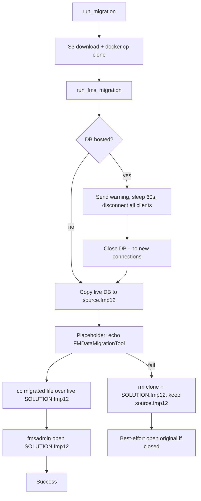

# FMS migration pipeline

## Current state

[`src/pipeline.py`](src/pipeline.py) downloads `{SOLUTION}_clone.fmp12` from S3, copies it to `/tmp/migration/clone.fmp12` in the FMS container, then calls `run_fms_migration()` which only runs a placeholder `ls -la /tmp/migration`. [`src/config.py`](src/config.py) has no FMS admin credentials yet.

## Target flow



## fmsadmin command mapping

Confirmed against the live `fms` container:

| User step | fmsadmin command | Notes |
|-----------|------------------|-------|
| 1a — disconnect all users with 1-minute grace | `send {file} -m "..."` → `sleep 60` → `disconnect client -y` | `DISCONNECT` has no `-t`; grace period is implemented with send + wait |
| 1b — close the database | `close {solution}.fmp12 -y -m "..."` | Fully closes the file; no new connections; safe to copy on disk |
| 5 — reopen after deploy | `open {solution}.fmp12` | After file replacement on disk |
| Failure recovery (if closed) | `open {solution}.fmp12` | Best-effort in `finally`; live file unchanged until deploy step |

All fmsadmin invocations run inside the FMS container via `docker exec` with `-y -u … -p …` (user chose env vars).

**Hosted check:** `fmsadmin list files` output contains `{solution}.fmp12` (case-sensitive filename match). Skip steps 1 and 5 when not hosted.

## Path constants

Add module-level helpers in [`src/pipeline.py`](src/pipeline.py):

- Live DB: `/opt/FileMaker/FileMaker Server/Data/Databases/{solution}.fmp12`
- Migration dir: `/tmp/migration/`
  - `clone.fmp12` — S3 clone (existing)
  - `source.fmp12` — copy of live DB before migration
  - `{solution}.fmp12` — migration tool output (replaces live on success)

## Code changes

### 1. [`src/config.py`](src/config.py) + [`example.env`](example.env)

Add required settings:

- `fms_admin_user: str`
- `fms_admin_password: str`

Include both in the non-empty validator and document in `example.env`.

### 2. [`src/pipeline.py`](src/pipeline.py) — helpers

- `_fms_databases_dir()` / `_live_db_path(solution)` / `_migration_paths(solution)` — centralize paths
- `_docker_sh(container, step, script)` — `docker exec … sh -c '…'` for multi-command steps and paths with spaces
- `_fmsadmin(container, settings, step, *args)` — builds authenticated `docker exec … fmsadmin -y -u … -p …`
- `_is_db_hosted(container, settings) -> bool` — parse `list files`
- `_prepare_hosted_db(container, settings)` — send → sleep 60 → disconnect → close; sets `db_closed = True`
- `_copy_live_to_source(container, settings)` — `cp` live path → `/tmp/migration/source.fmp12`
- `_run_migration_tool(container)` — placeholder: `echo FMDataMigrationTool` (replaceable later)
- `_deploy_migrated_db(container, settings)` — `cp /tmp/migration/{solution}.fmp12` → live path (only after tool succeeds)
- `_reopen_db(container, settings)` — `fmsadmin open {solution}.fmp12` (used on success and as best-effort failure recovery)
- `_cleanup_migration_artifacts(container, settings)` — `rm -f` `clone.fmp12` and `{solution}.fmp12` only (not `source.fmp12`)

### 3. [`src/pipeline.py`](src/pipeline.py) — `run_fms_migration`

Change signature to `run_fms_migration(settings: Settings) -> None` and implement the ordered steps above. Track `db_closed` locally; on any exception, run cleanup + best-effort `_reopen_db` (reopen errors logged, not re-raised).

Replace `fms_exec_args()` with `_run_migration_tool()` — remove the old TODO stub.

### 4. [`src/pipeline.py`](src/pipeline.py) — `docker_prepare` cleanup

Update `_ensure_fms_migration_dir` to accept `settings` and remove all three artifacts if present:

```python
rm -f /tmp/migration/clone.fmp12 /tmp/migration/source.fmp12 /tmp/migration/{solution}.fmp12
```

Use `rm -f` so missing files do not fail the step.

### 5. [`src/pipeline.py`](src/pipeline.py) — `run_migration` orchestration

- Pass `settings` into `_ensure_fms_migration_dir` and `run_fms_migration`
- In `finally` when `not succeeded`: keep existing `_remove_staging_clone(local_path)` and also call `_cleanup_migration_artifacts` (container-side cleanup is also handled inside `run_fms_migration` on FMS-step failure; the outer `finally` covers S3/download failures before FMS steps run)

## Security note

`fms_admin_password` will appear in `docker exec` argv (visible in process list / logs). This is inherent to `fmsadmin -p`; no change to logging of full commands beyond existing `_run_step` behavior.

## Out of scope (for later)

- Real `FMDataMigrationTool` command and its arguments
- Unit tests (none exist today)
- DB encryption `--key` handling on `open`
