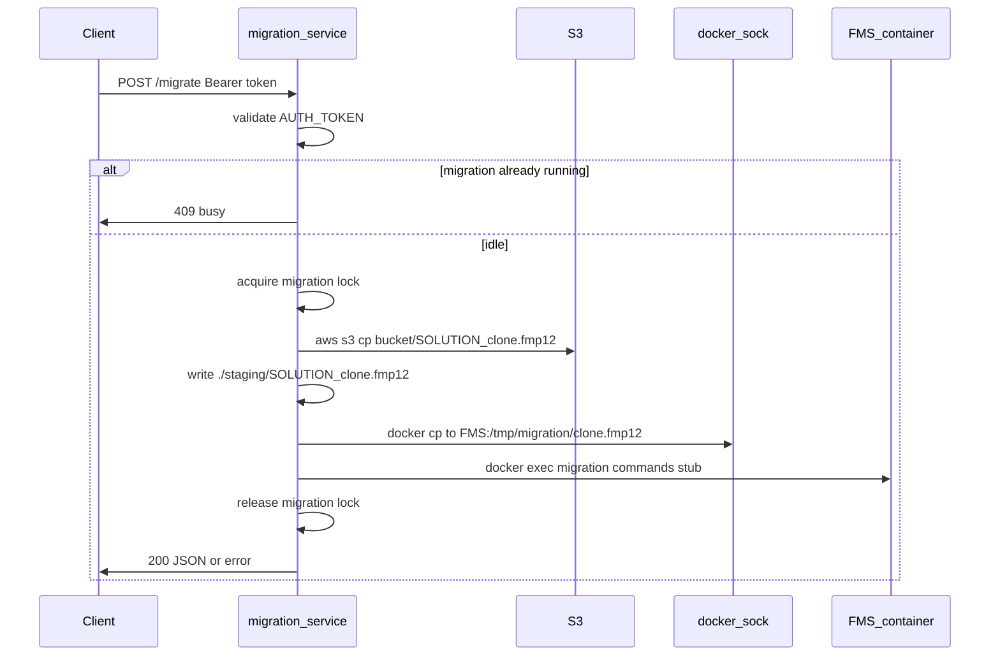

# Migration HTTP Service Plan

Prompt log: [prompts/migration_http_service_298d7df6.md](./prompts/migration_http_service_298d7df6.md)

Greenfield project — only [prompt.md](prompt.md) and Cursor config exist today. No code from other branches.

## Implementation order

1. **Scaffold** — project skeleton, `example.env`, empty `src/` package (done).
2. **Dockerization** — [Dockerfile](Dockerfile) (`base` / `develop` / `production`) and [compose.yml](compose.yml) (docker.sock, staging volume, Compose Watch). Enables `docker compose watch` before application logic lands.
3. **Config + auth** — [src/config.py](src/config.py), [src/auth.py](src/auth.py).
4. **Pipeline** — [src/pipeline.py](src/pipeline.py) (S3 → staging → docker cp → stub exec).
5. **AWS IAM README** — [docs/aws-iam.md](docs/aws-iam.md) (alongside or immediately after the S3 step).
6. **API** — [src/main.py](src/main.py) (`GET /health`, `POST /migrate`, single-flight lock).

## Architecture



## Project layout

```
migration/
├── compose.yml
├── Dockerfile
├── example.env          # committed env template — NOT .env.example (see Env template file)
├── .gitignore
├── requirements.txt
├── docs/
│   └── aws-iam.md       # IAM user + access keys + S3 policy (AWS only — no docker)
├── src/
│   ├── main.py          # FastAPI app, route, lifespan
│   ├── config.py        # env loading + validation
│   ├── auth.py          # Bearer token dependency
│   └── pipeline.py      # S3 → staging → docker cp → docker exec
└── staging/             # gitignored; runtime download dir
```

## HTTP API

| Item | Choice |
|------|--------|
| Method / path | `POST /migrate` |
| Auth | `Authorization: Bearer <AUTH_TOKEN>` (constant from `.env`) |
| Request body | None (SOLUTION is env-driven) |
| Success | `200` + `{ "status": "ok" }` |
| Auth failure | `401` |
| Migration already running | `409` + `{ "status": "busy" }` |
| Pipeline failure | `502` + `{ "status": "error", "step": "...", "detail": "..." }` |

Use **FastAPI** — minimal surface area, built-in dependency injection for auth, easy to extend when `docker exec` commands arrive.

### Concurrency (single-flight)

Only one migration may run at a time. If `POST /migrate` arrives while a prior request is still executing the pipeline, reject it immediately — do not queue or start a second run.

In [src/main.py](src/main.py), hold an in-process `asyncio.Lock` (or equivalent) around the full `run_migration()` call. Check/acquire before starting the pipeline; release in a `finally` block so failures still unblock later requests. This is sufficient for v1 because the service runs as a single process under uvicorn.

## Env template file

The committed env template is **[example.env](example.env)** — not `.env.example`.

- **Runtime secrets** live in `.env` (gitignored); Compose uses `env_file: .env`.
- **Do not create or restore `.env.example`.** That name is blocked by [.cursorignore](.cursorignore) (`**/*.env.*`), so agents cannot read it; `example.env` is explicitly allowed.
- Local setup: `cp example.env .env` then fill in values.

## Environment variables

Document in [example.env](example.env):

| Variable | Purpose |
|----------|---------|
| `AUTH_TOKEN` | Expected Bearer token |
| `BUCKET` | S3 bucket name (no `s3://` prefix) |
| `SOLUTION` | Prefix for object key `{SOLUTION}_clone.fmp12` |
| `FMS_CONTAINER` | Target container name or ID |
| `AWS_ACCESS_KEY_ID` / `AWS_SECRET_ACCESS_KEY` / `AWS_DEFAULT_REGION` | AWS CLI creds via env vars — omit when using mounted `~/.aws` instead (see below) |
| `PORT` | Default `8080` |

### AWS credentials

The AWS CLI needs credentials via **exactly one** of these — no instance profiles, task roles, or other chains:

1. **Env vars** — set `AWS_ACCESS_KEY_ID`, `AWS_SECRET_ACCESS_KEY`, and `AWS_DEFAULT_REGION` in `.env` (loaded by Compose).
2. **Mounted `~/.aws`** — bind-mount the host directory (e.g. `~/.aws:/root/.aws:ro` in [compose.yml](compose.yml)); leave the three env vars empty.

Document both options in [example.env](example.env). Optional AWS fields in [src/config.py](src/config.py) stay unset when using the mount.

Load via `pydantic-settings` in [src/config.py](src/config.py); fail fast at startup if required vars are missing.

## Pipeline implementation ([src/pipeline.py](src/pipeline.py))

Run each step with `subprocess.run(..., check=True, capture_output=True, text=True)` — matches your shell commands and keeps logs inspectable.

1. **Ensure staging dir** — `mkdir -p staging`
2. **S3 download**
   ```bash
   aws s3 cp "s3://${BUCKET}/${SOLUTION}_clone.fmp12" "./staging/${SOLUTION}_clone.fmp12"
   ```
3. **Docker copy** (requires `/var/run/docker.sock` mount)
   ```bash
   docker cp "./staging/${SOLUTION}_clone.fmp12" "${FMS_CONTAINER}:/tmp/migration/clone.fmp12"
   ```
4. **Docker exec (stub)** — placeholder function `run_fms_migration(container: str) -> None` that currently runs a no-op or a single harmless command (e.g. `docker exec ... ls /tmp/migration`) until you supply real commands. Structure it so swapping in real commands is a one-file change:

   ```python
   def fms_exec_args() -> list[str]:
       # TODO: replace with real FileMaker migration commands
       return ["ls", "-la", "/tmp/migration"]
   ```

   Then: `docker exec <FMS_CONTAINER> <args...>`.

Wrap the full pipeline in one `run_migration()` function; map `CalledProcessError` to step name + stderr for the HTTP error response.

When implementing the S3 step, also add [docs/aws-iam.md](docs/aws-iam.md) (see below).

## AWS IAM README ([docs/aws-iam.md](docs/aws-iam.md))

Create this alongside the S3 pipeline step. **AWS/IAM only** — do not duplicate docker, compose, curl, or local dev instructions the reader already knows.

**Include**

1. **Purpose** — one paragraph: dedicated IAM principal for the migration service to read clone files from a single bucket.
2. **Principal** — dedicated IAM user with access keys. Keys go in `.env` (`AWS_ACCESS_KEY_ID`, etc.) or in `~/.aws/credentials` on the host when that directory is mounted into the container.
3. **Policy** — least-privilege inline or managed custom policy. Required actions:
   - `s3:ListBucket` on `arn:aws:s3:::${BUCKET}` — list objects in the bucket (scoped with `s3:prefix` condition when practical)
   - `s3:GetObject` on `arn:aws:s3:::${BUCKET}/${SOLUTION}_clone.fmp12` — download the clone file
4. **Example policy document** — JSON with `${BUCKET}` / `${SOLUTION}` placeholders to substitute before attach:

   ```json
   {
       "Version": "2012-10-17",
       "Statement": [
           {
               "Sid": "ListBucketForClone",
               "Effect": "Allow",
               "Action": ["s3:ListBucket"],
               "Resource": "arn:aws:s3:::BUCKET_NAME",
               "Condition": {
                   "StringLike": {
                       "s3:prefix": ["SOLUTION_PREFIX_*"]
                   }
               }
           },
           {
               "Sid": "GetCloneObject",
               "Effect": "Allow",
               "Action": ["s3:GetObject"],
               "Resource": "arn:aws:s3:::BUCKET_NAME/SOLUTION_PREFIX_clone.fmp12"
           }
       ]
   }
   ```

5. **Setup steps** — create policy → create IAM user → attach policy → create access key → either map `AWS_ACCESS_KEY_ID`, `AWS_SECRET_ACCESS_KEY`, `AWS_DEFAULT_REGION` in `.env`, or place the same keys in `~/.aws/credentials` and mount `~/.aws`.
6. **Verification** — `aws s3 ls s3://BUCKET_NAME/SOLUTION_PREFIX_clone.fmp12` and `aws s3 cp` dry-run or head-object check using the new principal's creds.

**Exclude**

- Docker, compose, `docker cp`, `docker exec`, or service HTTP usage
- Generic AWS CLI install instructions

## Docker image ([Dockerfile](Dockerfile))

Multi-stage build with **`develop`** and **`production`** targets sharing a `base` stage:

**`base` stage**
- `python:3.12-slim`
- Install **AWS CLI v2** and **docker CLI** (client only — no daemon)
- `WORKDIR /app`
- Copy `requirements.txt`, `pip install`
- Copy `src/`

**`develop` target**
- `CMD` → `uvicorn src.main:app --host 0.0.0.0 --port ${PORT:-8080} --reload`
- Used by Compose Watch for live code sync

**`production` target**
- Same as develop but without `--reload` (for non-watch deploys later)

## Compose ([compose.yml](compose.yml))

```yaml
services:
  migration:
    build:
      context: .
      target: develop
    env_file: .env
    ports:
      - "${PORT:-8080}:8080"
    volumes:
      - /var/run/docker.sock:/var/run/docker.sock
      - ./staging:/app/staging
      - ~/.aws:/root/.aws:ro   # omit when using AWS_* env vars instead
    develop:
      watch:
        - action: sync
          path: ./src
          target: /app/src
        - action: rebuild
          path: ./requirements.txt
```

**Notes**
- `docker.sock` mount gives the service permission to `docker cp` / `docker exec` against containers on the **host** (including `FMS_CONTAINER` running outside this compose stack).
- `./staging` bind-mount keeps downloaded `.fmp12` visible on the host for debugging and avoids re-downloading on container recreate if desired.
- `~/.aws` mount is the alternative to `AWS_*` env vars — use one credential method, not both.
- Run as root inside the container (default) — required for typical docker.sock access unless you map the host `docker` GID.

## Supporting files

- **[requirements.txt](requirements.txt)** — `fastapi`, `uvicorn[standard]`, `pydantic-settings`
- **[example.env](example.env)** — committed env template (`cp example.env .env`); **never** add `.env.example`
- **[.gitignore](.gitignore)** — `.env`, `staging/`, `__pycache__/`, `.venv/`
- **[docs/aws-iam.md](docs/aws-iam.md)** — IAM setup for S3 access (see AWS IAM README section)
- **[src/auth.py](src/auth.py)** — FastAPI `Depends` that compares Bearer token to `config.auth_token` using `secrets.compare_digest`
- **[src/main.py](src/main.py)** — `GET /health` (unauthenticated, for compose/orchestrator checks) + `POST /migrate` with single-flight lock

## Local dev workflow

```bash
cp example.env .env    # fill in values (or mount ~/.aws and skip AWS_* vars)
docker compose watch   # rebuild on requirements change, sync src on save
curl -X POST http://localhost:8080/migrate \
  -H "Authorization: Bearer $AUTH_TOKEN"
```

## Out of scope (for later)

- Real `docker exec` FileMaker commands (stub only)
- Request-scoped `SOLUTION` (fixed per deployment per your choice)
- TLS termination, rate limiting, job queue / async long-running migrations
- Running FMS container in the same compose file (assumed external; referenced by name)
- Cross-process or multi-replica migration locking (single uvicorn worker assumed for v1)

## Risks / assumptions

- **FMS container must exist** and be reachable by the name in `FMS_CONTAINER` before calling `/migrate`.
- **`/tmp/migration/`** must exist inside FMS container or `docker cp` parent path must be creatable — if not, add a preparatory `docker exec ... mkdir -p /tmp/migration` in the stub step.
- **AWS credentials** inside the migration container must come from **env vars or a mounted `~/.aws` directory only** — not instance profiles or task roles; see [docs/aws-iam.md](docs/aws-iam.md) for IAM user setup.
- **Large `.fmp12` files** — synchronous request may time out; acceptable for v1; can move to background job later if needed.
- **Concurrent callers** — second and later requests while a migration is in flight receive `409`; clients should retry after the in-progress run finishes.

